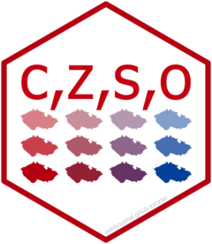
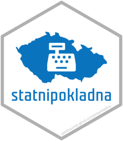
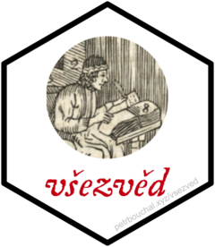
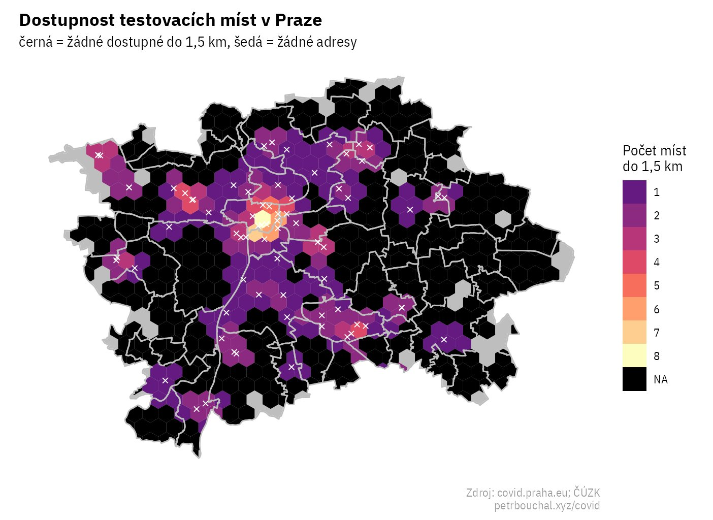
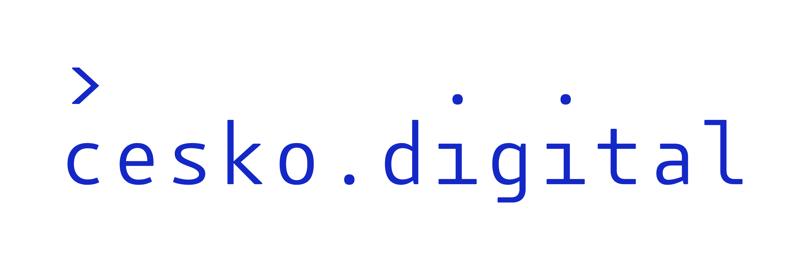
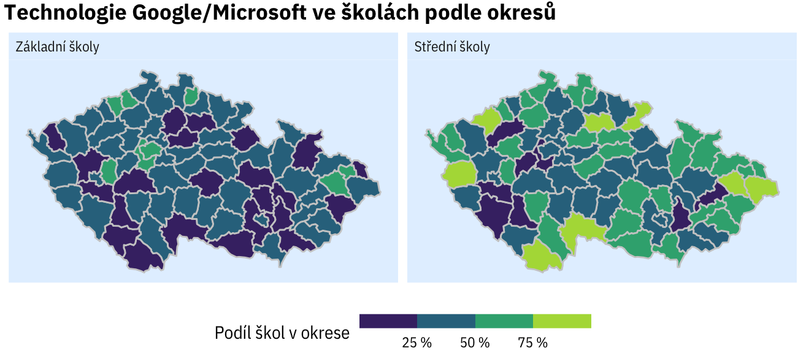
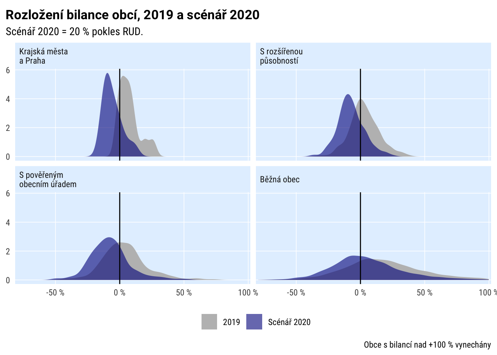
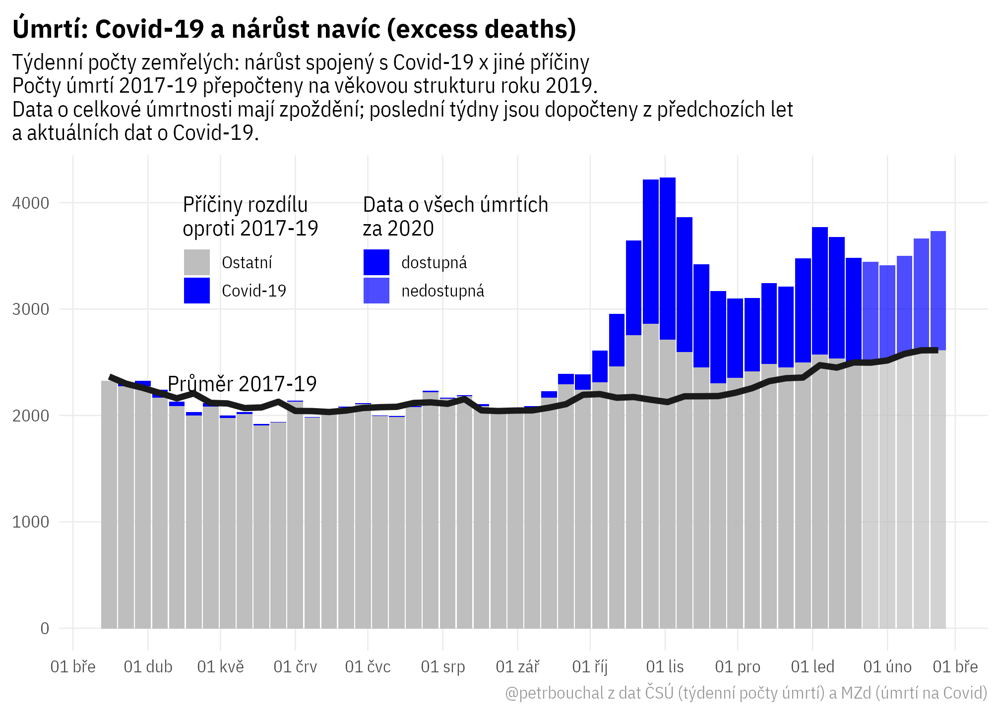

```{r setup, include=FALSE}
options(htmltools.dir.version = FALSE)
knitr::opts_chunk$set(fig.retina = 3, echo = F,
                      cache = F,
                      warning = F,
                      comment = "",
                      dev = "ragg_png",
                      message = F)
library(fontawesome)
library(tidyverse)
library(ptrr)
library(ragg)
library(knitr)

library(xaringanExtra)
# library(flipbookr)

ptrr::set_geom_defaults()
update_geom_defaults("rect", list(fill = "blue"))

# options(tibble.print_min = 20)
```

```{r, include=FALSE}
xaringanExtra::use_xaringan_extra("share_again")

xaringanExtra::style_share_again(
  share_buttons = c("twitter", "linkedin", "pocket")
)

xaringanExtra::use_extra_styles(
  hover_code_line = TRUE,         
  mute_unhighlighted_code = TRUE  
)
```


```{r xaringan-themer, include=FALSE, warning=FALSE}
library(xaringanthemer)
style_mono_accent(
  base_color = "#0000ff",
  header_font_google = google_font("IBM Plex Sans"),
  text_font_google   = google_font("IBM Plex Sans"),
  code_font_google   = google_font("IBM Plex Mono"),
  table_row_even_background_color = "#fff",
)
```

```{r fonts, include=FALSE}
ptrr::register_plexsans()
ptrr::register_plexsans_condensed()
```

```{r meta, include=FALSE, eval = FALSE}
library(metathis)
meta() %>%
  meta_general(
    description = "Lepší využití dat ve státní správě",
    generator = "xaringan and remark.js"
  ) %>% 
  meta_name("github-repo" = "petrbouchal/opendataexpo2021") %>% 
  meta_social(
    title = "Title",
    url = "https://petrbouchal.xyz/opendataexpo2021",
    image = "https://petrbouchal.xyz/opendataexpo2021/twitter_card.png",
    image_alt = "social alt",
    og_type = "website",
    og_locale = "cs_CZ",
    og_author = "Petr Bouchal",
    twitter_card_type = "summary_large_image",
    twitter_creator = "@petrbouchal"
  ) %>% 
  write_meta("meta.html")
```

class: left, middle, inverse

# Pandemie ukázala problémy<br />s veřejnými daty

---
class: left, middle, mega

 1\. Je jich málo

--

 2\. Uvnitř se s nimi málo pracuje (nemůže/nedokáže)

--

 3\. Zvenku je to těžké (kvalita, dostupnost, dokumentace)

---
class: left, middle, large, inverse

# Co s tím

---
class: left, middle, mega, inverse

zlepšit práci s vlastními daty uvnitř

za pomoci existujících nástrojů

a dobudování podpory/infrastruktury

---
class: left, middle, mega, inverse

Na čem stavět

---
class: left, top, large, inverse

Lepší přístup: Česká a světová open data v R

--

Lepší výstup: Rmarkdown / Jupyter

--

Proces a kvalita: postupy pro reprodukovatelnou analýzu

--
 
Inspirace: [rOpenSci](https://ropensci.org/), [rOpenSpain](https://ropenspain.es), [rOpenGov](http://ropengov.org/), UK GDS: [RAP Companion](https://ukgovdatascience.github.io/rap_companion/)

--

---

.large.center[

[](https://petrbouchal.xyz/czso) [](https://petrbouchal.xyz/statnipokladna) [](https://petrbouchal.xyz/vsezved)  [](https://petrbouchal.xyz/pragr)

🇨🇿 {[RCzechia](https://cran.r-project.org/package=RCzechia)} · {[CzechData](https://jancaha.github.io/CzechData/)} · {[hlidacr](https://cran.r-project.org/package=hlidacr)}

.medium[Jindra Lacko 👏 · Jan Caha 👏 · Michael Škvrňák 👏]

 🇪🇺 {[eurostat](http://ropengov.github.io/eurostat/index.html)} 🏦 {[wbstats](https://cran.r-project.org/package=wbstats)} 🌍 {[OECD](https://cran.r-project.org/package=OECD)}  🗺 {[giscoR](https://dieghernan.github.io/giscoR/)}

]

---
class: left, middle, inverse

# Příklady využití

---
class: center, middle

 

---
class: center, middle





---
class: center, middle



---
class: center, middle



---
class: left, middle, mega, inverse

# Co je třeba

---
class: left, middle, mega, inverse

Pomoct budovat dovednosti

Propojit + přiblížit ekosystém nástrojů

Support & komunita

Zázemí v úřadu: technické, právní, HR


---

class: center, middle, mega, inverse


Máte chuť pomoct? 

Pomohlo by vám to?

[petrbouchal.xyz/opendataexpo2021](https://petrbouchal.xyz/opendataexpo2021)

---

class: inverse, bottom, right
layout: false

.large[
<a href="https://twitter.com/petrbouchal">`r fa("twitter", fill = "white")`</a> <a href="https://github.com/petrbouchal">`r fa("github", fill = "white")`</a> <a href="https://linkedin.com/in/petrbouchal">`r fa("linkedin", fill = "white")`</a> petrbouchal

[petrbouchal.xyz](petrbouchal.xyz)

[pbouchal@gmail.com](mailto:pbouchal@gmail.com) 
]


